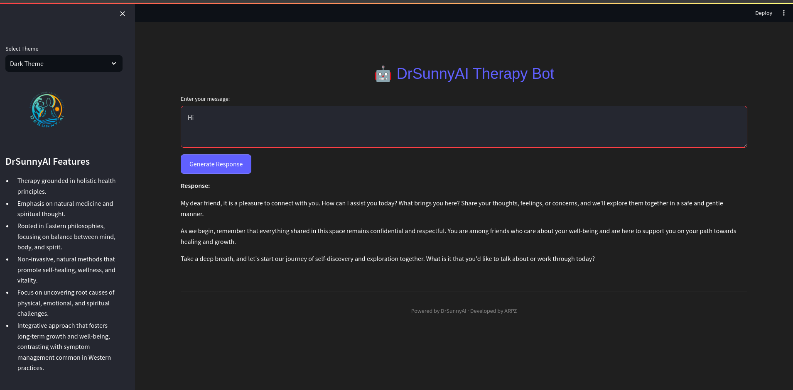
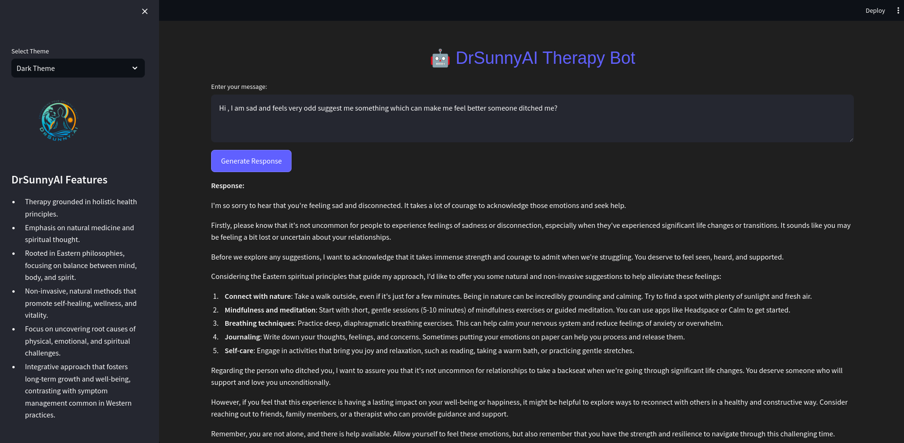

---

# 🧘 Spiritual Therapy Bot: Asian Ways of Treatment 🌿

This repository contains a **Spiritual Therapy Bot** that provides guidance based on traditional Asian treatments and methods using **LLaMA 3.1B**. The application uses **Ollama** as the language model backend and **Streamlit** to create a user-friendly web interface.



---

## 🛠 Features
- **Therapy Guidance**: Based on traditional Asian medicinal treatments, such as Ayurveda, acupuncture, herbal medicine, and meditation.
- **Conversational AI**: Powered by **LLaMA 3.1B** to give human-like responses.
- **Simple UI**: Built with **Streamlit**, providing an easy-to-use web interface.
- **Flexible Deployment**: Easy to set up locally and modify for various use cases.

---

## 🚀 Quick Start

Follow the steps below to get the app running locally.

### 1. Install Ollama
Ollama is required to run the **LLaMA 3.1B** model locally. Here's how you can set it up:

1. **Run the following command to install Ollama**:
    ```bash
    curl -fsSL https://ollama.com/install.sh | sh
    ```

2. **Download the LLaMA 3.1B model**:
    ```bash
    ollama pull llama3.1:8b
    ```

3. **Test the model**:
    Run a basic test to make sure the model works:
    ```bash
    ollama run llama3.1:8b
    ```

---

### 2. Clone the Repository
Once **Ollama** is set up, clone this repository to your local machine:
```bash
git clone https://github.com/yourusername/spiritual-therapy-bot.git
cd spiritual-therapy-bot
```

### 3. Install Required Dependencies
Create a Python virtual environment and install the required packages:
```bash
# Create and activate virtual environment
python3 -m venv venv
source venv/bin/activate  # for macOS/Linux
venv\Scripts\activate  # for Windows

# Install dependencies
pip install -r requirements.txt
```

### 4. Setting Up Streamlit
Make sure you have **Streamlit** installed. You can check by running:
```bash
streamlit --version
```

If not installed, run:
```bash
pip install streamlit
```

### 5. Running the App
Now, start the **Streamlit** app:
```bash
streamlit run app.py
```

This will launch the app, and you can open it in your browser at `http://localhost:8501`.

---

## ⚙️ Configuration

1. **`app.py`** contains the main Streamlit app, which connects to Ollama’s API and uses **LLaMA 3.1B** to respond to user queries about traditional Asian therapies.

2. **Environment Variables**: You may need to configure some environment variables for **Ollama** to work properly.

---

## 🖼 Screenshots

### App Home Page:


### Example Conversation:


---

## 📝 To-Do
- [ ] Improve therapy responses with more datasets on traditional medicine.
- [ ] Add more treatment methods like Reiki and Shiatsu.
- [ ] Add voice-to-text integration for a more interactive experience.

---

## 👨‍💻 Contributing
Feel free to open an issue or pull request to contribute! Any suggestions for improving the therapy bot or adding new treatment techniques are welcome.

---

## 📜 License
This project is licensed under the MIT License - see the [LICENSE](LICENSE) file for details.

---

### 🙏 Acknowledgments
Thanks to **Ollama** and **Streamlit** for making this project possible.

---

